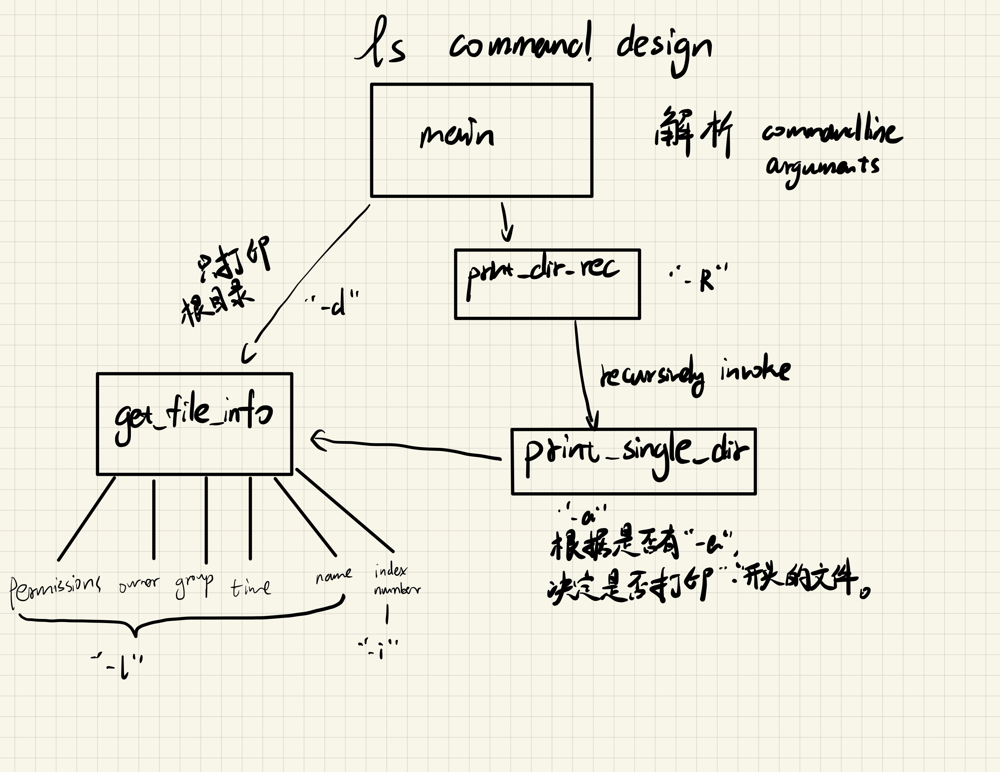

# homework 3: ls and wc command

## ls

### command arguments

#### -l

use a long listing format

包括：

1. 文件权限，以如`-rwxrwxr-x`的格式打印。分别代表文件类型、三类用户的读写执行权限。
2. 

#### -a

do not ignore entries starting with .

#### -d

list directories themselves, not their contents

#### -R

list subdirectories recursively

#### -i

print the index number of each file

### 设计

#### get_file_info 模块

对某一文件，获得对应的信息，并进行必要的解析（即将 stat 结构体转换为一个可以直接用于打印的自定义结构体，后者定义在模块头文件中），包括 `-l`, `-i` 所需要的信息。

需要注意的是，不支持 `~/Desktop` 这样的路径，必须使用绝对路径，如 `/home/leo/Desktop`